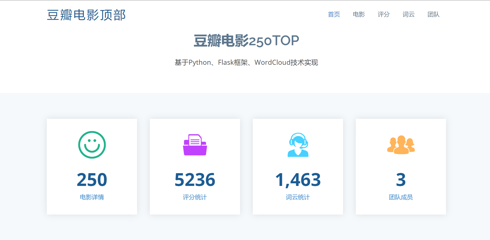
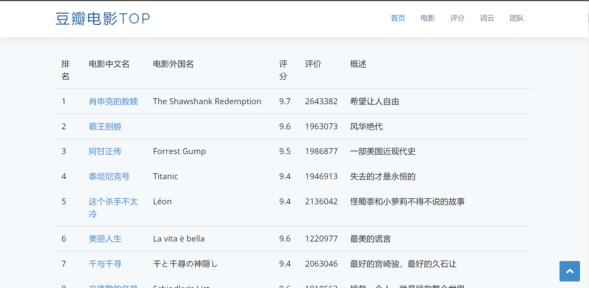
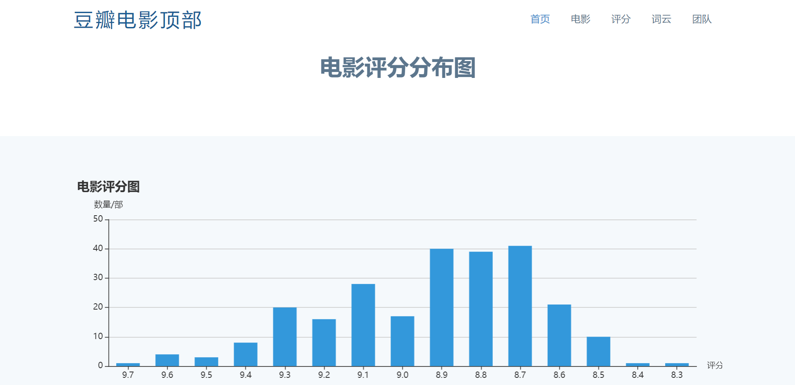
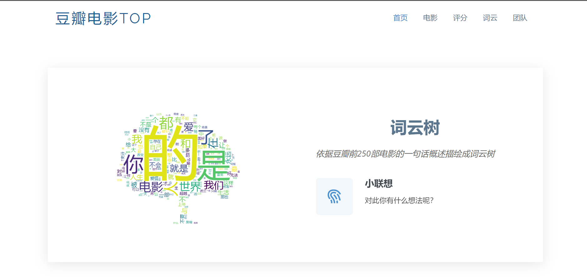
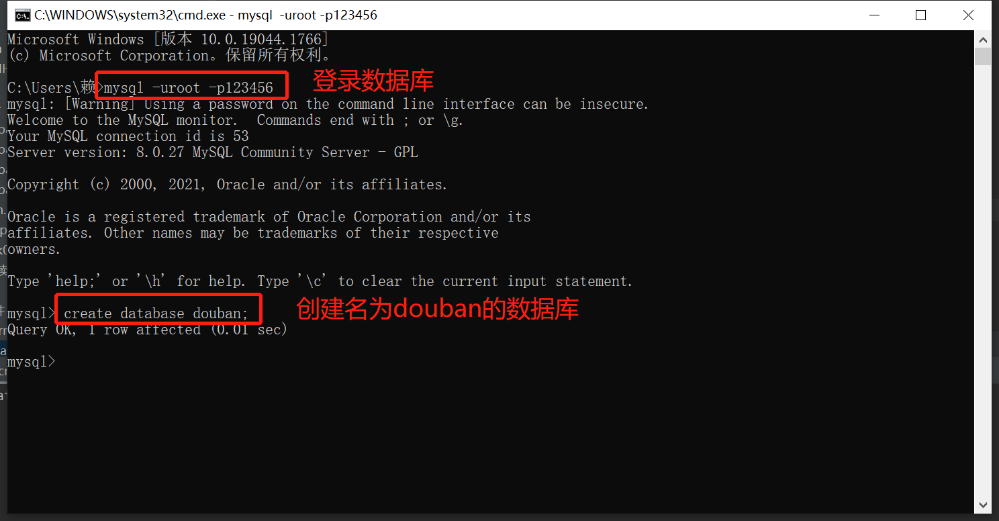
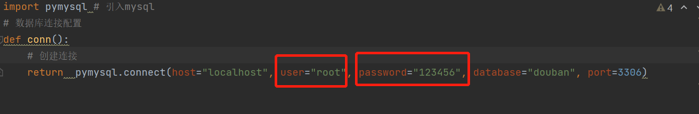
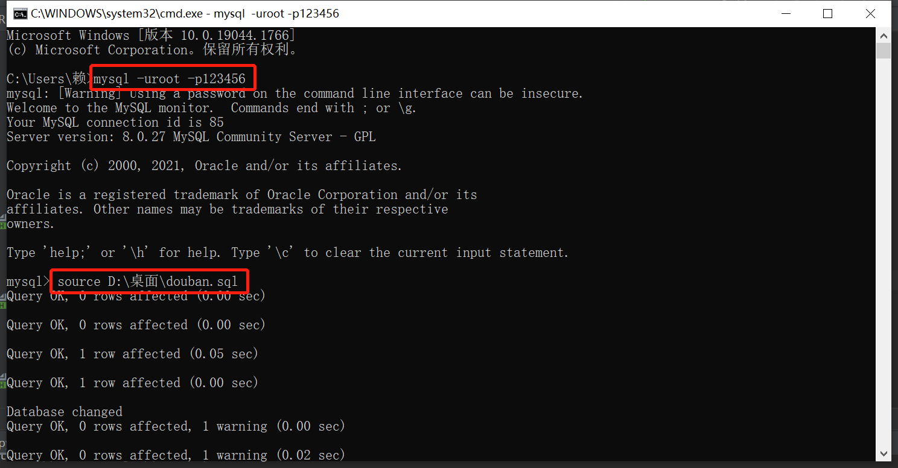

# 基于Python、Flask框架、WordClond技术实现豆瓣电影爬取和数据可视化

---------------------------------------------------------------------
## 一、项目介绍
### 1.1 项目背景
  此次豆瓣数据爬取是本人在大一期间参考b站（ https://www.bilibili.com/video/BV12E411A7ZQ?spm_id_from=333.999.0.0&vd_source=3f0d7f9282738e445137bab93a9fb417 ）独立完成，
现在重新整理代码并将原来通过SQLit3数据保存方式更新为Mysql方式。
### 1.2 项目技术
  项目涵盖的技术主要包括：

    Python
    Flask
    WordClond
    Echart
### 1.3 项目展示

---------------------------------------------------------------------
## 二、工作准备
### 2.1 网页
  项目爬取的网页： https://movie.douban.com/top250

### 2.2 文件介绍
    Read文件夹下的内容是对本次项目详细介绍
    static文件夹下的内容是存储相关静态设置，如img、css等基本设置
    templates文件夹下的内容是存储前端的html相关模板
    conn.py 是配置Mysql的文件
    dataScraping.py 是爬取并保存数据的文件
    frontPage.py 是读取并可视化数据的文件
    
### 2.1 数据库配置
  首先请进入cmd窗口，登入mysql完成**建立douban数据库**操作，这是此次项目用到的数据库。

  

  修改conn.py文件的user和password参数，更改为你的Mysql的名称和密码，其他不变。

  到这里数据库配置就此完成。

### 2.2 数据库导入
  如果你嫌弃**2.1操作**麻烦不想创建数据库，那也可以选择通过导入我创建好的数据库douban.sql，里面也已经创建好数据表doubantop250，具体导入操作如下：
    
    找到并复制下载好的douban.sql路径，比如我是保存在 D:\桌面\douban.sql ，这个目录一定要准确，后面是有接douban.sql;
    
    登入Mysql，然后输入 source 数据库路径，比如我就是 source D:\桌面\douban.sql

  **到这里成功导入数据库和数据表，然后记得要将dataScrapying.py 第115行代码 init_DB() 注释掉，这句是创建数据表doubantop250，否则会报错。**

